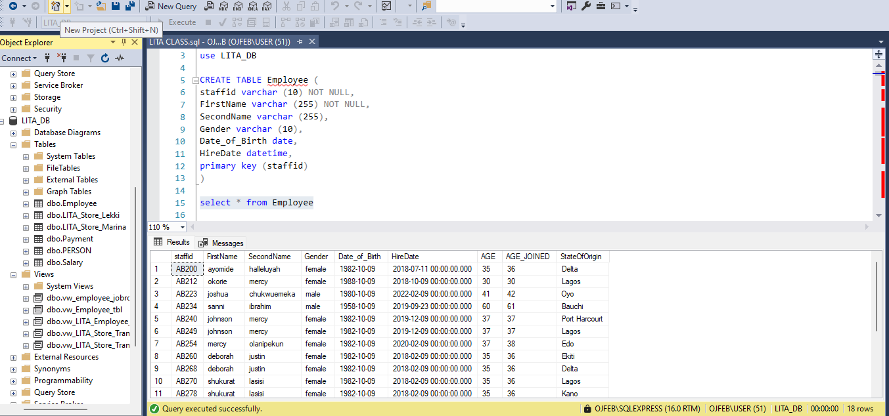
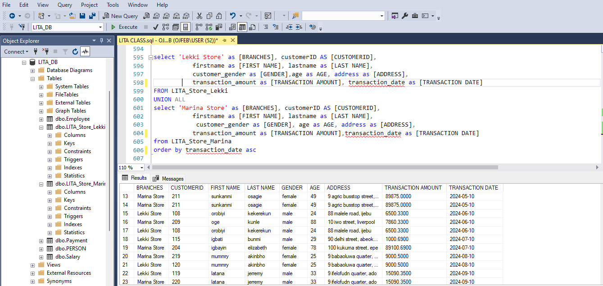
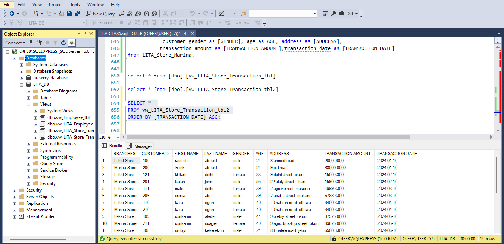
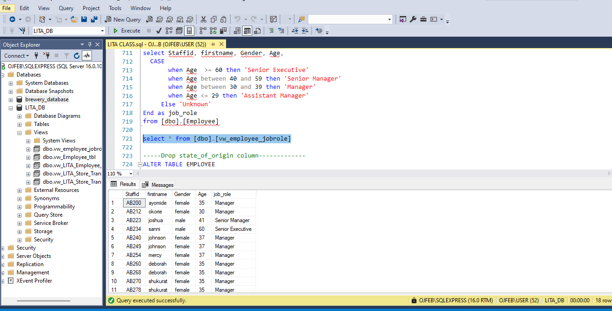
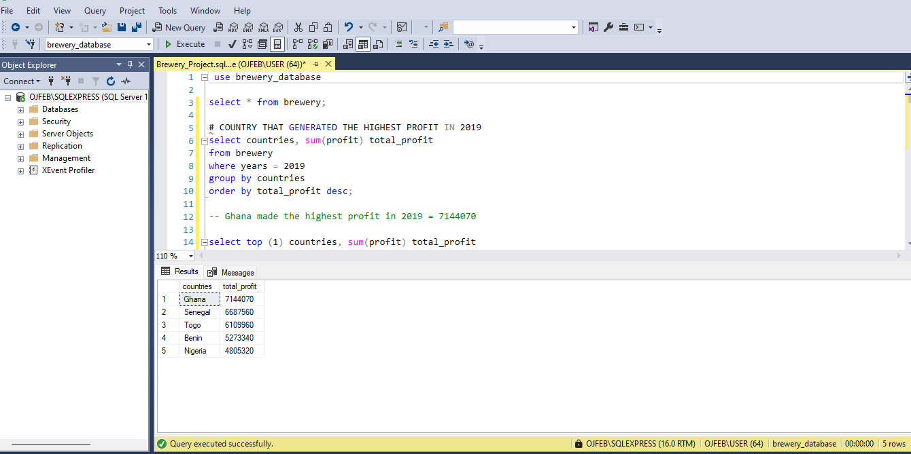

# DATA ANALYTICS LEARNING WITH LITA


[Foundation of Data](#foundation-of-data)

[Tools Used](#tools-used)

[Microsoft Excel Class](#microsoft-excel-class)

[Microsoft Excel Project](#microsoft-project)

[SQL Class](#sql-class)

[SQL Syntax](#sql-syntax)

[SQL Project](#sql-sproject)

[GitHub Class](#github-class)

## FOUNDATION OF DATA
The foundation of data refers to the basic principles and concepts that underpin how data is collected, managed, analyzed, and utilized in decision-making processes.
During the first week of training, we delved into several key topics, including data literacy, data generation, data sources, data structure, data storage, and data analysis. I gained an understanding of how organizations operate two primary systems: operational systems, which handle day-to-day transactions, and analytic systems, which focus on data insights and decision-making. A significant part of the discussions was centered on how to efficiently restructure and manage data using the ETL (Extract, Transform, Load) process, which plays a crucial role in transforming raw data into meaningful insights.

## Data Structure
 * Structured Data: Organized data, typically in rows and columns (e.g., databases, spreadsheets).
 * Unstructured Data: Data that doesn’t follow a specific format (e.g., text files, social media posts, videos).
 * Semi-Structured Data: Contains elements of both structured and unstructured data (e.g., XML, JSON).

## Data Storage
It can happen in two main ways:
1. *On-Premises*:  
   - Data is stored within the organization's servers.
   - Accessible only from within the organization.
   - Offers more control and security but requires more maintenance.
2. *Cloud*:  
   - Data is stored remotely in data centers accessed via the internet.
   - Accessible from anywhere with an internet connection.
   - Flexible and scalable but relies on external service providers.
  
## Data Analysis
Data Analysis helps businessess make informed decisions, understand customer behaviour, improve operations, and predict future trends.
  - Helps organizations make decisions based on actual data rather than intuition or guesswork.
  - Identifies inefficiencies in processes, leading optimization and cost reduction.
  - Identifies target markets and creating more effective marketing strategies.
  - Helps in assessing credit risk, fraud detection, and compliance with regulatory standards.
  - It can also enhance transparency with stakeholders, improving the company’s reputation and brand loyalty.
  - Data-driven insights can lead to the development of new products or services by identifying unmet customer needs or market gaps.

## TOOLS USED
  1. Micrsoft Excel for Data cleaning, Analysis, Visualization and Reporting
  2. SQL Server - Structured Query Language for Quering of Data
  3. GitHub for Portfolio Building
  4. Microsoft Power BI for ETL, Data Modeling, Analysis, Visualization and Reporting


## MICROSOFT EXCEL CLASS

### Excel Tools and Data Reporting
We explored Excel in depth, starting with data cleaning and manipulation using various formulas. One of the key focuses was learning how to manage data entry and apply data validation techniques to help minimize errors during the entry process. We practiced a variety of functions:- Arithmetic Functions, Logical Functions, Text Functions and Lookup Functions. Cell referencing was introduced during our session on lookup functions. In our final lecture on Excel, we focused on reporting, where we covered how to create Pivot Tables, Pivot Charts, and build comprehensive reports using these tools.


## MICROSOFT EXCEL PROJECT
## Introduction
I am analyzing sales performance across different dimensions. The data was collected from various regions and markets in Nigeria, focusing on four lines of business.

Fields in the Dataset:
 - **Region:** Geographic area.
 - **Market:** State the store operates in.
 - **Store:** City of the store.
 - **Trade Date:** Date of the transaction.
 - **Fiscal Period:** Financial period.
 - **Model:** Product model or category.
 - **Line of Business:** Business sector.
 - **Day Category:** Transaction day classification (e.g., weekday, weekend).
 - **Revenue:** Total sales amount.
 - **Units Sold:** Quantity of items sold.
 - **Transaction Category:** Each sale is classified into one of these three categories (Low, Medium, or High) based on the number of units sold.

### Data Manipulation


### Pivot Table


### Pivot Chart


### Sales Report Dashboard


## Observation and Conclusion
**Revenue by Region:** The revenue analysis by region highlights the North East as the most profitable area, while the South West and South South also contribute significantly. The North Central region, however, presents an opportunity for further development. Targeted marketing strategies and tailored approaches to increase engagement in lower-performing regions could help optimize overall revenue across the country.

**Monthly Revenue:** By identifying potential seasonal trends, adjusting marketing efforts, and optimizing product offerings, the business can aim to maintain higher revenue levels consistently across all months.
   * Peak Revenue Months: The highest revenue was recorded in March (₦8,458,780,440), followed closely by May (₦8,348,649,000).
   * Decline in Mid-Year: Revenue saw a significant drop starting in July, with monthly figures dropping to below ₦4 billion. This decline continues through December.
   * Lowest Revenue Months: July recorded the lowest revenue at ₦3,976,032,960, with similar low figures in the subsequent months, indicating a potential seasonal downturn.

**Units Sold by Region:** The analysis of units sold by region shows that the North East is the leading market, followed by the South West and South South. The North Central region presents an opportunity for improvement. To optimize overall sales, businesses should consider targeted marketing efforts and strategies aimed at boosting engagement and sales in regions with lower performance.

**Revenue by Transaction Category:** Strategies should prioritize boosting revenue from medium transactions while also seeking opportunities to enhance high-value sales.
   * Low Transaction Category: Despite accounting for the largest number of units sold (14,763 units), the low category generates less revenue compared to the medium category. This suggests that items in this category are priced lower, which impacts the total revenue generated, even though sales volume is high.
   * Medium Transaction Category: This category contributes the largest share of the overall revenue. Even though it ranks second in terms of units sold (12,016 units), the revenue it generates is the highest. This could imply that items in the medium category have a balanced mix of volume and pricing, making it a key driver of revenue.
   * High Transaction Category: Although this category has the lowest number of units sold (4,020 units), it still contributes a notable share of the revenue, which indicates that the items in this category are of higher value, generating more revenue per transaction. However, since fewer units are sold, its contribution to the overall revenue is the smallest.

## SQL CLASS
SQL (Structured Query Language) is a standard programming language specifically designed for managing, querying, and manipulating relational databases. SQL stands for Structured Query Language. 

## SQL Commands
 - SQL commands are instructions. It is used to communicate with the database.
 - It is also used to perform specific tasks, functions, and queries of data.
 - SQL can perform various tasks like create a table, add data to tables, drop the table, modify the table, set permission
for users.
### Types of SQL Commands
There are five types of SQL commands:
 - DDL: Data Definition Language
 - DML: Data Manipulation Language
 - DCL: Data Control Language
 - TCL: Transaction Control Language
 - DQL: Data Query Language

## Key SQL Concepts
1. Databases and Tables
      * Database: A structured collection of data. Think of it as a file cabinet containing organized information.
      * Table: A structured format within a database that consists of rows and columns (similar to Excel spreadsheets). Each row represents a record, and each column represents a field (attribute) within the data.
2. SQL Queries A query is a request for data or information from a database. It allows users to retrieve, insert, update, or delete data from database tables.
3. Data Types Every column in a table has a data type that defines the kind of data it can hold:Numeric Data Types, Character String Data Types, Binary Data Types, Date and Time Data Types.

## SQL Keys
They are fundamental concepts in relational database design and management. They are used to uniquely identify records within tables and establish relationships between different tables. Understanding SQL keys is essential for maintaining data integrity and enforcing constraints within a database.


## SQL Features
These features make SQL a versatile and essential language for working with databases. Whether you're querying data, modifying structures, or ensuring data integrity, SQL provides the necessary tools and capabilities.
Key Features Learned in SQL: SQL Operators, SQL Aggregation functions, SQL Set Operations, SQL Case When Statement, SQL Joins, SQL Clauses, SQL View.


## SQL SYNTAX
```SQL
   CREATE database LITA_DB
```

```SQL
   SELECT * FROM Employee
```
### Creating Database and Table

### SQL Union

### SQL Views

### SQL Case

### SQL Join

### SQL Operators


During our final lecture, we successfully imported a CSV file into SQL, where I had the opportunity to explore and manipulate the dataset using several SQL operators. This involved performing queries to filter, sort, and aggregate the data, which helped me gain a deeper understanding of how to extract meaningful insights from raw data using SQL. The hands-on experience of applying these operators reinforced my learning and enhanced my data analysis skills.

## SQL PROJECT
[Here](https://github.com/OJFEB/LITA_Knowledge_Log/blob/main/SQL_Project.sql) is a link to the SQL script.


## GITHUB CLASS
GitHub has played a crucial role in my data analysis journey with The Incubator Hub, where I learned to create repositories that facilitate the management, documentation, and sharing of my projects.


This documentation reflects my current progress in my learning journey. I have gained valuable skills in data analysis and GitHub, and I am particularly excited about the upcoming Power BI training. I am committed to continuing my growth and applying my knowledge to future projects. The best is yet to come! Thank you 🥰
